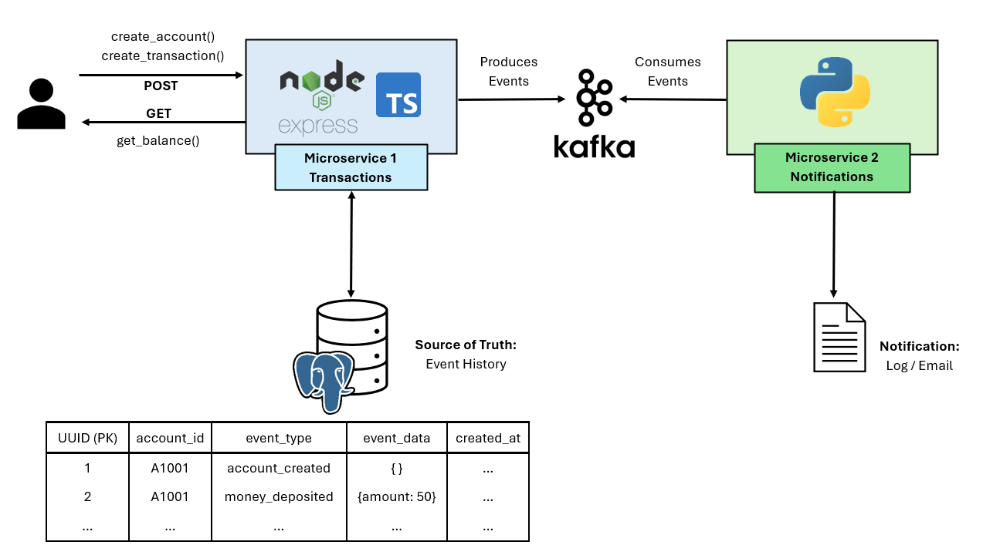
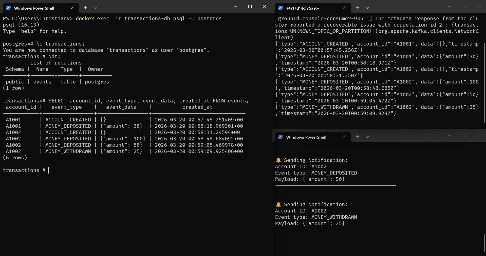
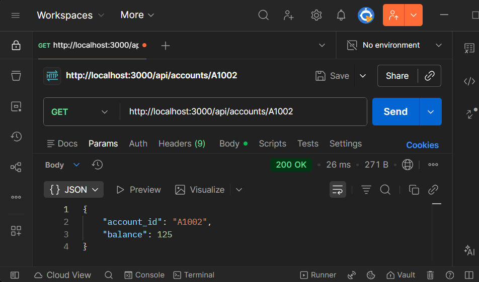

# Event-Sourcing Pattern Demo

A demonstration of the **event-sourcing pattern** in a event driven architecture.

This project consists of two microservices: a **transactions microservice** that handles financial transactions, and a **notifications microservice** that listens to transaction events and sends notifications accordingly.

Instead of storing account balances directly into the database, the system stores **events** (account created, deposits, withdrawals). The current state of an account is reconstructed from its event history. 

Parallel to storing events in the database, the transactions microservice also publishes these events to a Kafka topic. The notifications microservice consumes these events to send notifications.

## Architecture



## Project Structure

```
event-sourcing-demo/
├── docker-compose.yml
├── transactions-microservice/
└── notifications-microservice/
```

## Getting Started

1. Clone the repository:
    ```bash
    git clone
    cd event-sourcing-demo
    ```

2. Define environment variables for the transactions microservice in `transactions-microservice/.env`:
    ```
    DB_HOST=db
    DB_PORT=5432
    POSTGRES_USER=postgres
    ...
    ```

3. Start the services using Docker Compose:
    ```bash
    docker-compose up --build
    ```

4. The transactions microservice will be available at `http://localhost:3000`. You can use tools like Postman or curl to interact with the API.


## API Usage

It is recommended to use Postman or curl to interact with the API.

### Create Account
**Endpoint:** `POST /api/accounts`

Request Body:
```json
{
  "account_id": "A1002"
}
```

### Make a Transaction
**Endpoint:** `POST /api/accounts/transactions`

Request Body:
```json
{
  "account_id": "A1002",
  "amount": 100
}
```

**Note:** Positive amounts are deposits, negative amounts are withdrawals.

### Get Account Balance
**Endpoint:** `GET /api/accounts/{account_id}`

Response Body:**
```json
{
  "account_id": "A1002",
  "balance": 100
}
```

## How Event-Sourcing Works

Each action generates an immutable event stored in PostgreSQL:

ACCOUNT_CREATED

MONEY_DEPOSITED

MONEY_WITHDRAWN

The balance is calculated dynamically by replaying events.

Every event is also published to Kafka so other services can react asynchronously.

## Inspect What's Happening

Use separate terminals to monitor logs.





### Database — View Stored Events
```bash
docker exec -it transactions-db psql -U postgres -d transactions
```
Then run:
```sql
SELECT * FROM events;
```

### Kafka — View Published Events
```bash
docker exec -it kafka bash
```
Then run:
```bash
kafka-console-consumer \
  --bootstrap-server localhost:9092 \
  --topic transactions \
  --from-beginning
```

### Notifications — View Sent Notifications
```bash
docker exec -it notification-service bash
```
Then run:
```bash
python notifications.py
```

## Strengths of This Pattern

- **Complete audit trail** — every change is stored as an immutable event.
- **Rebuildable state** — account state can be reconstructed at any time.
- **Loose coupling** — services communicate asynchronously through Kafka.
- **Scalable** — producers and consumers scale independently.
- **Extensible** — new services can react to events without changing the API.
- **Resilient** — events act as a durable source of truth.